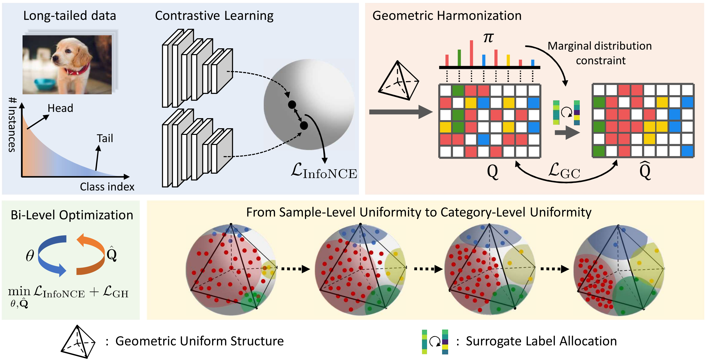

<h1 align="center">Combating Representation Learning Disparity<br>with Geometric Harmonization</h1>

<p align="center">
    <a href="https://arxiv.org/abs/2310.17622"></a>
    <a href="https://openreview.net/forum?id=geLARFEK8O"></a>
    <a href="https://github.com/MediaBrain-SJTU/Geometric-Harmonization"></a>
    <a href="https://neurips.cc/media/PosterPDFs/NeurIPS%202023/70835.png?t=1699436032.259549"> </a>
</p>


**Keywords**: Self-Supervised Learning, Long-Tailed Learning, Category-Level Uniformity

Neural Information Processing Systems(NeurIPS) 2023, Spotlight

<div align="left">
  
</div>

**Abstract**: Self-supervised learning (SSL) as an effective paradigm of representation learning has achieved tremendous success on various curated datasets in diverse scenarios. Nevertheless, when facing the long-tailed distribution in real-world applications, it is still hard for existing methods to capture transferable and robust representation. Conventional SSL methods, pursuing sample-level uniformity, easily leads to representation learning disparity where head classes dominate the feature regime but tail classes passively collapse. To address this problem, we propose a novel Geometric Harmonization (GH) method to encourage category-level uniformity in representation learning, which is more benign to the minority and almost does not hurt the majority under long-tailed distribution. Specially, GH measures the population statistics of the embedding space on top of self-supervised learning, and then infer an fine-grained instance-wise calibration to constrain the space expansion of head classes and avoid the passive collapse of tail classes. Our proposal does not alter the setting of SSL and can be easily integrated into existing methods in a low-cost manner. Extensive results on a range of benchmark datasets show the effectiveness of GH with high tolerance to the distribution skewness.

This repository is the official Pytorch implementation of Geometric Harmonization.

## Citation

If you find our work inspiring or use our codebase in your research, please consider giving a star ⭐ and a citation.
```
@inproceedings{zhou2023combating,
  title={Combating Representation Learning Disparity with Geometric Harmonization},
  author={Zhou, Zhihan and Yao, Jiangchao and Hong, Feng and Zhang, Ya and Han, Bo and Wang, Yanfeng},
  booktitle={Thirty-seventh Conference on Neural Information Processing Systems},
  year={2023}
}
```


## Get Started

### Environment
- Python (3.7.10)
- Pytorch (1.7.1)
- torchvision (0.8.2)
- CUDA
- Numpy

### File Structure

After the preparation work, the whole project should have the following structure:

```
./Boosted-Contrastive-Learning
├── README.md
├── BCL                             # Baseline BCL implementation
│   ├── memoboosted_cifar100.py
│   ├── memoboosted_LT_Dataset.py                   
│   └── randaug.py
├── SDCLR                           # Baseline SDCLR implementation
│   ├── resnet_prune_multibn.py
│   ├── resnet_prune.py
│   └── sdclr.py
├── target                          # Geometric uniform structure weights
├── split                           # data split
│   ├── ImageNet_LT                   
│   └── Places_LT
├── datasets.py                     # datasets
├── models.py                       # models
├── resnet.py                       # backbone 
├── resnet_imagenet.py              # backbone w.r.t. deeper resnet
├── test_cifar.py                   # testing code on CIFAR-100-LT
├── test_imagenet_places.py         # testing code on ImageNet-LT and Places-LT
├── train_cifar.py                  # training code on CIFAR-100-LT
├── train_imagenet_places.py        # training code on ImageNet-LT and Places-LT
└── utils.py                        # utils
```

### Training on CIFAR-100-LT

To train model on CIFAR-100-LT, simply run:

- SimCLR
```train SimCLR
python train_cifar.py --method simclr --gpus ${gpu_id} --log_folder ${log_folder}
```

- SimCLR + GH
```train SimCLR + GH
python train_cifar.py --method simclr_GH --warm_up 500 --target_dim 100 --gpus ${gpu_id} --log_folder ${log_folder}
```

- Focal
```train focal
python train_cifar.py --method focal --gpus ${gpu_id} --log_folder ${log_folder}
```

- Focal + GH
```train Focal + GH
python train_cifar.py --method focal_GH --warm_up 500 --target_dim 100 --gpus ${gpu_id} --log_folder ${log_folder}
```

- SDCLR
```train SDCLR
python train_cifar.py --method sdclr --gpus ${gpu_id} --log_folder ${log_folder}
```

- SDCLR + GH
```train SDCLR + GH
python train_cifar.py --method sdclr_GH --warm_up 500 --target_dim 100 --gpus ${gpu_id} --log_folder ${log_folder}
```

- BCL
```train BCL
python train_cifar.py --method simclr --bcl --gpus ${gpu_id} --log_folder ${log_folder}
```

- BCL + GH
```train BCL + GH
python train_cifar.py --method simclr_GH --bcl --warm_up 500 --target_dim 100 --gpus ${gpu_id} --log_folder ${log_folder}
```

Note: `--wandb` can be used to track the experiments.

### Evaluating on CIFAR-100-LT

To evalutate the pretrained model, simply run:

- Test
```test
python test_cifar.py --gpus ${gpu_id} --checkpoint_path ${checkpoint_path} --log_folder ${log_folder}
```

### Training on ImageNet-LT and Places-LT

To train model on ImageNet-LT and Places-LT, simply run:

- launch cmd
```
launch_cmd="python -m torch.distributed.launch --nproc_per_node=${GPU_NUM} --master_port ${port}"
```

- SimCLR
```train SimCLR
${launch_cmd} train_imagenet_places.py --method simclr --data ${data} --dataset ${dataset} --log_folder ${log_folder}
```

- SimCLR + GH
```train SimCLR + GH
${launch_cmd} train_imagenet_places.py --method simclr_GH --warm_up 400 --target_dim 100 --data ${data} --dataset ${dataset} --log_folder ${log_folder}
```

- Focal
```train focal
${launch_cmd} train_imagenet_places.py --method focal --data ${data} --dataset ${dataset} --log_folder ${log_folder}
```

- Focal + GH
```train Focal + GH
${launch_cmd} train_imagenet_places.py --method focal_GH --warm_up 400 --target_dim 100 --data ${data} --dataset ${dataset} --log_folder ${log_folder}
```

- SDCLR
```train SDCLR
${launch_cmd} train_imagenet_places.py --method sdclr --data ${data} --dataset ${dataset} --log_folder ${log_folder}
```

- SDCLR + GH
```train SDCLR + GH
${launch_cmd} train_imagenet_places.py --method sdclr_GH --warm_up 400 --target_dim 100 --data ${data} --dataset ${dataset} --log_folder ${log_folder}
```

- BCL
```train BCL
${launch_cmd} train_imagenet_places.py --method simclr --bcl --data ${data} --dataset ${dataset} --log_folder ${log_folder}
```

- BCL + GH
```train BCL + GH
${launch_cmd} train_imagenet_places.py --method simclr_GH --bcl --warm_up 400 --target_dim 100 --data ${data} --dataset ${dataset} --log_folder ${log_folder}
```

Note: `--wandb` can be used to track the experiments.

### Evaluating on ImageNet-LT and Places-LT

To evalutate the pretrained model, simply run:

- Test
```test
${launch_cmd} test_imagenet_places.py --gpus ${gpu_id} --checkpoint_path ${checkpoint_path} --data ${data} --dataset ${dataset} --log_folder ${log_folder}
```

Note: `--method` should be used to specify the pretrained method.


### Extensions

**Steps to Implement Your Own Model**

- Add your model to ./models and load the model in train.py.
- Implement functions(utils.py) specfic to your models in train.py.

**Steps to Implement Other Datasets**

- Create long-tailed splits of the datasets and add to ./split.
- Implement the dataset (e.g. memoboosted_cifar100.py).
- Load your data in train.py.

## Acknowledgement

We borrow some codes from [BCL](https://github.com/MediaBrain-SJTU/BCL), [SDCLR](https://github.com/VITA-Group/SDCLR), [RandAugment](https://github.com/ildoonet/pytorch-randaugment) and [W-MSE](https://github.com/htdt/self-supervised).

## Contact
If you have any problem with this code, please feel free to contact **zhihanzhou@sjtu.edu.cn**.